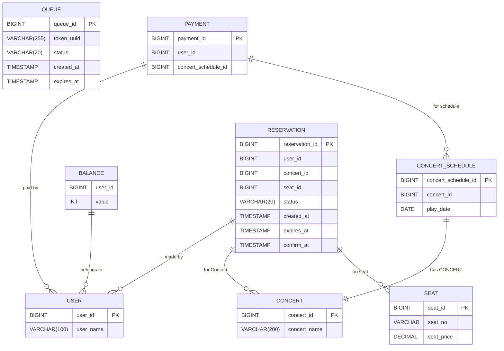

```

-- User 테이블
CREATE TABLE User (
    user_id BIGINT AUTO_INCREMENT PRIMARY KEY,
    user_name VARCHAR(100) NOT NULL
);

-- Concert 테이블
CREATE TABLE Concert (
    concert_id BIGINT AUTO_INCREMENT PRIMARY KEY,
    concert_name VARCHAR(200) NOT NULL
);

-- Concert_Schedule 테이블
CREATE TABLE Concert_Schedule (
    concert_schedule_id BIGINT AUTO_INCREMENT PRIMARY KEY,
    concert_id BIGINT UNIQUE NOT NULL,
    play_date DATE NOT NULL
);

-- Seat 테이블
CREATE TABLE Seat (
    seat_id BIGINT PRIMARY KEY,
    seat_no VARCHAR(20) NOT NULL,
    seat_price DECIMAL(10, 2) NOT NULL,
);

-- Queue 테이블
CREATE TABLE Queue (
    queue_id BIGINT AUTO_INCREMENT PRIMARY KEY,      -- 대기열 ID
    token_uuid VARCHAR(255) NOT NULL UNIQUE,         -- 대기열 토큰 (UUID)
	status VARCHAR(20) NOT NULL,                      -- 상태 ID (WAITING, ACTIVE, EXPIRED)
    created_at TIMESTAMP DEFAULT CURRENT_TIMESTAMP, -- 대기열 진입 시간
    expires_at TIMESTAMP DEFAULT NULL,              -- 대기열 만료 시간
);

-- Balance 테이블
CREATE TABLE Balance (
    user_id BIGINT NOT NULL,
    value INT NOT NULL
);

-- Reservation 테이블
CREATE TABLE Reservation (
    reservation_id BIGINT AUTO_INCREMENT PRIMARY KEY,
    user_id BIGINT NOT NULL,
    concert_id BIGINT NOT NULL, 
    seat_id BIGINT NOT NULL
	status VARCHAR(20) NOT NULL,                      -- 상태 ID (PROGRESS, COMPLETED)
    created_at TIMESTAMP DEFAULT CURRENT_TIMESTAMP, -- 좌석 임시 예매 잠금 시간
    expires_at TIMESTAMP DEFAULT NULL,              -- 좌석 임시 예매 해제 시간
	confirm_at TIMESTAMP DEFAULT NULL				-- 좌석 예약 확정 시간
);

-- Payment 테이블
CREATE TABLE Payment (
    payment_id BIGINT AUTO_INCREMENT PRIMARY KEY,
    user_id BIGINT NOT NULL,
    concert_schedule_id BIGINT NOT NULL,
);

```