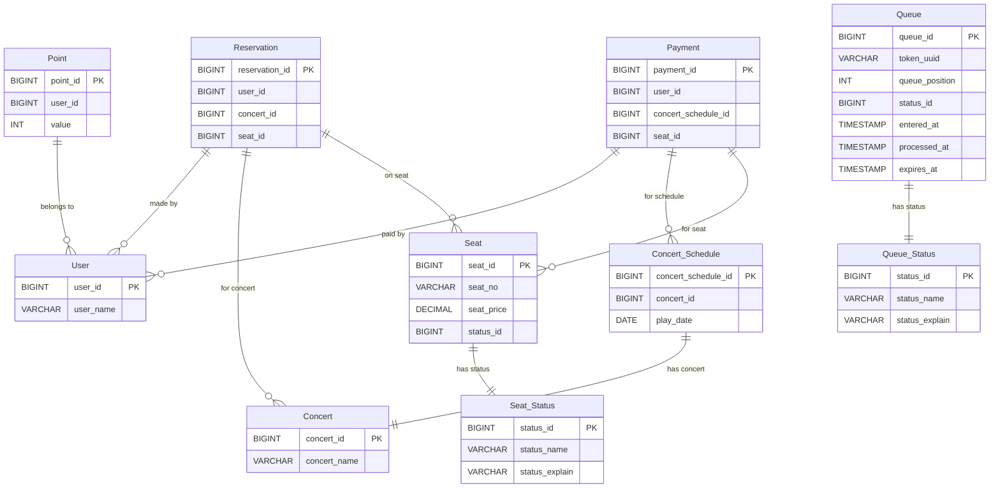

```SQL
-- User 테이블
CREATE TABLE User (
    user_id BIGINT AUTO_INCREMENT PRIMARY KEY,
    user_name VARCHAR(100) NOT NULL
);

-- Concert 테이블
CREATE TABLE Concert (
    concert_id BIGINT AUTO_INCREMENT PRIMARY KEY,
    concert_name VARCHAR(200) NOT NULL
);

-- Concert_Schedule 테이블
CREATE TABLE Concert_Schedule (
    concert_schedule_id BIGINT AUTO_INCREMENT PRIMARY KEY,
    concert_id BIGINT UNIQUE NOT NULL,
    play_date DATE NOT NULL
);

-- Seat_Status 테이블
CREATE TABLE Seat_Status (
    status_id BIGINT AUTO_INCREMENT PRIMARY KEY,
    status_name VARCHAR(20) NOT NULL UNIQUE,
    status_explain VARCHAR(255)
);

-- Seat 테이블
CREATE TABLE Seat (
    seat_id BIGINT AUTO_INCREMENT PRIMARY KEY,
    seat_no VARCHAR(20) NOT NULL,
    seat_price DECIMAL(10, 2) NOT NULL,
    status_id BIGINT NOT NULL,
    CONSTRAINT fk_seat_status FOREIGN KEY (status_id) REFERENCES Seat_Status (status_id)
);

-- Queue_Status 테이블
CREATE TABLE Queue_Status (
    status_id BIGINT AUTO_INCREMENT PRIMARY KEY,
    status_name VARCHAR(20) NOT NULL UNIQUE,
    status_explain VARCHAR(255)
);

-- Queue 테이블
CREATE TABLE Queue (
    queue_id BIGINT AUTO_INCREMENT PRIMARY KEY,      -- 대기열 ID
    token_uuid VARCHAR(255) NOT NULL UNIQUE,         -- 대기열 토큰 (UUID)
    queue_position INT NOT NULL,                    -- 대기열 순서
    status_id BIGINT NOT NULL,                      -- 상태 ID (WAITING, IN_PROGRESS 등)
    entered_at TIMESTAMP DEFAULT CURRENT_TIMESTAMP, -- 대기열 진입 시간
    processed_at TIMESTAMP DEFAULT NULL,            -- 처리 완료 시간
    expires_at TIMESTAMP DEFAULT NULL,              -- 대기열 만료 시간
    CONSTRAINT fk_queue_status FOREIGN KEY (status_id) REFERENCES Queue_Status (status_id)
);

-- Point 테이블
CREATE TABLE Point (
    point_id BIGINT AUTO_INCREMENT PRIMARY KEY,
    user_id BIGINT NOT NULL,
    value INT NOT NULL
);

-- Reservation 테이블
CREATE TABLE Reservation (
    reservation_id BIGINT AUTO_INCREMENT PRIMARY KEY,
    user_id BIGINT NOT NULL,
    concert_id BIGINT NOT NULL,
    seat_id BIGINT NOT NULL
);

-- Payment 테이블
CREATE TABLE Payment (
    payment_id BIGINT AUTO_INCREMENT PRIMARY KEY,
    user_id BIGINT NOT NULL,
    concert_schedule_id BIGINT NOT NULL,
    seat_id BIGINT NOT NULL
);

-- 인덱스 생성
CREATE INDEX idx_status_queue_position 
ON Queue (status_id, queue_position);

```
